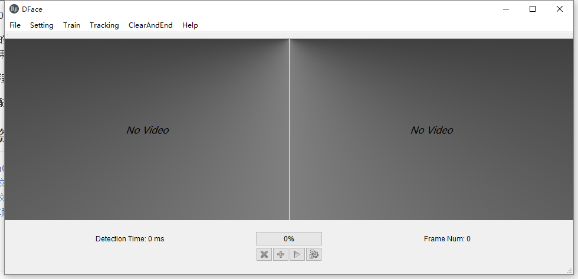

# About

本程序是一款windows软件，主要用了opencv3.1 + opencv_contrib + qt 5.6 + vs2015。

原先是做的人脸检测，后来加入了人脸识别和目标物体的追踪，最终对人脸打上马赛克。本人初学者，这些东西都是现学现卖，代码写得好烂。。

[安装程序下载](http://gh60.cn/upload/setup.exe)

软件截图

## 参考资料

* [OpenCV3编程入门_毛星云编著_电子工业出版](http://gh60.cn/upload/OpenCV3.pdf)
* [官方文档](http://gh60.cn/opencv3/)
* [中文文档](http://www.opencv.org.cn/opencvdoc/2.3.2/html/doc/tutorials/tutorials.html)

